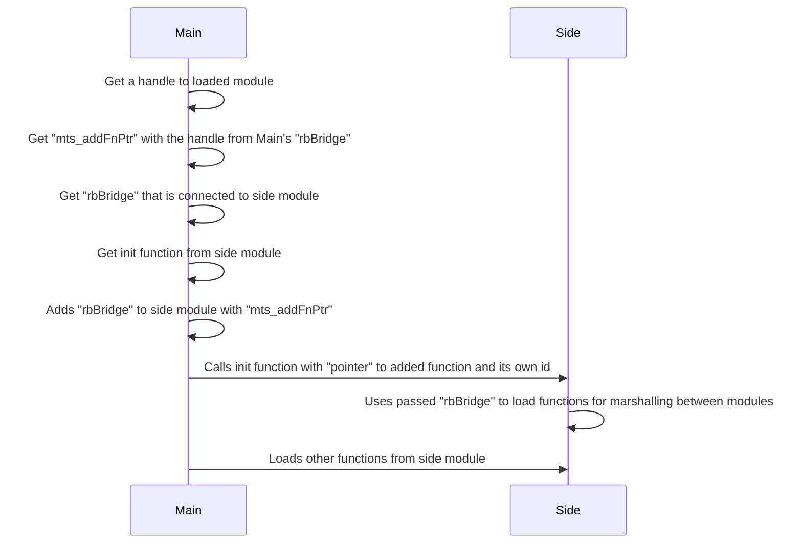
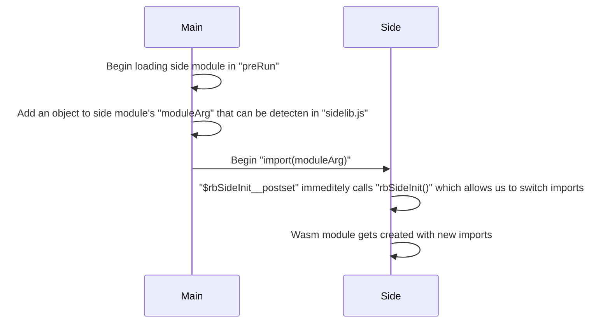

# Wasm Pseudo Linking demo

This repo demonstrates a possible way to marshal memory and function calls
between 2 separate wasm modules.

Simple benchmark [in action](https://noctemcat.github.io/wasm_pseudo_linking/)
(Press F12 see current actions in console). Also loads dotnet webassembly.

## How it works

With the help of manually written wasm modules that are responsible for
memory operations and additional js glue that gets function from one
module and adds it to another.

There are 3 helper modules:

1. `accessor`
2. `bridge`
3. `bridge_fb`

The first is responsible for accessing only one wasm module and provides getters
and setters for basic wasm types, a `"rbBridge"` function that allows you to access
exported functions from all of them, it can also return different `"rbBridge"`
connected to other modules.

The third is a fallback for second, so it provides the same functionality. Which
is `memcpy` analog that allows you to copy data between memories, and js import that
takes a function pointer from one module, gets the function from the wasm table,
adds it to the table from other module, and returns the new function pointer.

In other words in combination this allows to:

- Directly access basic types from other module
- Marshal data with `memcpy` analog between modules
- Turn function pointers from other wasm module into callable function pointers from
  current module

The basic flowcharts, the terminology **main** and **side** modules was borrowed from
`emscripten` , which this tries to emulate

### Possible ways to access them

1. Pass `"rbBridge"` to init function and use it from the side module to establish
   communication



2. Add it as a wasm module import by replacing dummy functions from special `--js-library`
   passed to side module with the help of `xxx__postset`



Second needs some timing considerations to make `bridge` and `bridge_fb` work, mainly
`-sIMPORTED_MEMORY` flag for side module, which can be worked around with imported
from outside `Module.wasmMemory`.

Imported `memcpy` doesn't perform too different from the ones from loaded
function pointer, so it's possible to only switch functions from `accessor`
and simply load `memcpy` later with the help of imported `"rbBridge"`. This
will allow us to switch dummy functions immediately without the need for
timing, and remove `-sIMPORTED_MEMORY`, which will massively simplify it

<details>

<summary>Timing details</summary>

As it was tested on other emscripten main module and C# wasm, both of them had
different time for calling `$rbSideInit__postset`

`Emscripten` timing:

1. `rbSideInit` called from `$rbSideInit__postset`
2. `wasmMemory` created
3. `preInit` called
4. Wasm module gets created

`Dotnet` timing:

1. `wasmMemory` created
2. `rbSideInit` called from `$rbSideInit__postset`
3. Wasm module gets created
4. `preInit` called

For now it tests for `wasmMemory` and switches up functions when needed. If
`Module.wasmMemory` is present it will just use it without any problem and
switch functions immediately

Alternatively as mentioned above, we can only import functions from main's
`accessor`, so then the timing will be:

1. `rbSideInit` called from `$rbSideInit__postset`

When switching functions only from main's `accessor` we don't need memory
from second, which allows us to create bridge later after wasm was created

</details>

### Memory operations

They are achieved with importing several memories with multy memory supprot and
copying data using builtin function

```wat
;; mts -> main to side
;; stm -> side to main
(import "main" "memory" (memory $memMain 1))
(import "side" "memory" (memory $memSide 1))

(func (export "mts_memcpy") (param $dest i32) (param $src i32) (param $size i32)
  (memory.copy $memSide $memMain (local.get $dest) (local.get $src1) (local.get $size))
)
(func (export "stm_memcpy") (param $dest i32) (param $src i32) (param $size i32)
  (memory.copy $memMain $memSide (local.get $dest) (local.get $src) (local.get $size))
)
```

The fallback works with the help of getters and setters from main's `accessor`,
side's `accessor`, and manually adapted `memcpy` mentioned in [bulk-memory-operations](https://github.com/WebAssembly/bulk-memory-operations/blob/master/proposals/bulk-memory-operations/Overview.md#bulk-memory-operations-prototype)
overview, after some testing it looks like it is good enough, but it can be
improved if needed.

At first javascript `memcpy` analog was tried, but it proved to be too slow.

The fallback is needed because Safari still doesn't support multi memory. Also
to support older browsers.

<details>

<summary>Fallback code</summary>

`stm_memcpy` is the same only with functions swapped

```wat
;; mts -> main to side
;; stm -> side to main
(type $getIntType (func (param $addr i32) (result i32)))
(type $getIntType64 (func (param $addr i32) (result i64)))
(type $setIntType (func (param $addr i32) (param $value i32)))
(type $setIntType64 (func (param $addr i32) (param $value i64)))
(type $memcpyType (func (param $dest i32) (param $src i32) (param $size i32)))

(import "main" "getI8" (func $mainGetI8 (type $getIntType)))
(import "main" "getI64" (func $mainGetI64 (type $getIntType64)))

(import "side" "setI8" (func $sideSetI8 (type $setIntType)))
(import "side" "setI64" (func $sideSetI64 (type $setIntType64)))

(func $mts_memcpy (export "mts_memcpy") (type $memcpyType)
  ;; 0: dest, 1: src, 2: size
  (if
    (i32.eq
      (i32.and (local.get 0) (i32.const 7))
      (i32.and (local.get 1) (i32.const 7)))
    (then
      (loop $lp
        (if
          (i32.and (local.get 0) (i32.const 7))
          (then
            (if (i32.eqz (local.get 2)) (then return))
            (call $sideSetI8 (local.get 0) (call $mainGetI8 (local.get 1)))
            (local.set 0 (i32.add (local.get 0) (i32.const 1)))
            (local.set 1 (i32.add (local.get 1) (i32.const 1)))
            (local.set 2 (i32.sub (local.get 2) (i32.const 1)))
            (br $lp)
          )
        )
      )
      (loop $lp
        (if
          (i32.ge_s (local.get 2) (i32.const 8))
          (then
            (call $sideSetI64 (local.get 0) (call $mainGetI64 (local.get 1)))
            (local.set 0 (i32.add (local.get 0) (i32.const 8)))
            (local.set 1 (i32.add (local.get 1) (i32.const 8)))
            (local.set 2 (i32.sub (local.get 2) (i32.const 8)))
            (br $lp)
          )
        )
      )
    )
  )
  (loop $lp
    (if
      (i32.gt_s (local.get 2) (i32.const 0))
      (then
        (call $sideSetI8 (local.get 0) (call $mainGetI8 (local.get 1)))
        (local.set 0 (i32.add (local.get 0) (i32.const 1)))
        (local.set 1 (i32.add (local.get 1) (i32.const 1)))
        (local.set 2 (i32.sub (local.get 2) (i32.const 1)))
        (br $lp)
      )
    )
  )
)
```

</details>

### Threads

For now doesn't work with them, currently both single-threaded. After some testing it is
theoretically possible to do a limited main multi-threaded, side single-threaded or
a limited main single-threaded, side multi-threaded. But the diffuculty rise sharply
so it is not worth to implement it currently. I guess main multi-threaded, side multi-threaded
could be possible, but it would be even more limited than other versions.

## Current implementation

`C++` was compiled with `emscripten` and `Wasm` text files were compiled
with `wasm-as` bundled inside `emscripten`

Current implementation heavily depends on `emscripten`, but theoretically
it should be possible to achieve the same thing without it.

## Local testing

`C++` needs `emscripten` and `cmake`, `C#` needs `dotnet` with `wasm-tools` installed,
`Vue` needs `Node.js` with `yarn`, `Wasm` uses `wasm-as` included in `emscripten`.
Tested on linux, bash build scripts were designed to be launched either from
the root or from inside the appropriate folder. The output from each is copied
to the root ./output folder, which is symlinked to ./web/public

On linux install everything and run

```bash
./build.sh
cd web
yarn
yarn dev
```

or

```bash
cd web
yarn
yarn devb
```

If you are on Windows, you can open `bash` scripts and adjust commands inside,
the first and last commands in `build.sh` can be ignored, `cp` copies files,
`mkdir` creates directories, `$EMSDK` is an environment variable that was set
after installing `emscripten`
